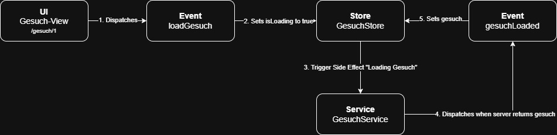

# StateManagement

In kiBon, we use the library [NgRX](https://ngrx.io/) to manage states. More specifically, we
use the [SignalStore](https://ngrx.io/guide/signals/signal-store) with events where needed.

To get a solid grip on NgRX and the SignalStore, please refer to the official documentation.
In this document, we will focus on how we use these tools to manage state and explain some
architectural decisions.

## Events In A SignalStore

The SignalStore has the possibility to provide and act on events, just like the
full-fledged [store](https://ngrx.io/guide/store). This has two main benefits:

- We decouple, **what** is happening from **how** it is reacted to. For example,
  we have an event that says "load gesuch" that is triggered by a dashboard component.
  On this event happening, SignalStores can then react to it accordingly, the dashboard
  component does not have to know which stores to touch and how to touch them. It simply
  tells, what happened or what should happen.

- We can perform side effects. When we update a store (e.g. the gesuch we requested is
  loaded from the backend, and we set it in our store), we may want to start some other process
  in some other store. We may want to react on it by emptying some state or reloading some data.
  Without an event, we'd have to do this by triggering this change from our first store. This
  couples the stores tightly and integrates the side effect into the main flow. With an event,
  the store simply triggers the event and does not know which side effects are thus triggered.

### Example "Load Gesuch"

This is an example how the loading of a gesuch could be done with a SignalStore and Events.

1. The UI is opened. Nothing is yet loaded from the server. The ID of the gesuch is present
   in the URL. The UI triggers/dispatches the _loadGesuch_ event with the id as payload
2. The store then reacts upon this event and sets its _isLoading_ property to _true_ to reflect
   that no gesuch is present, but some loading process has been triggered.
3. The store performs a side effect upon the (_loadGesuch_) event. It tells the GesuchService
   to load the data.
4. The service has received the data from the server and triggers/dispatches the _gesuchLoaded_
   event with the gesuch as payload
5. The store reacts upton this _gesuchLoaded_ event and sets its _gesuch_ property to the gesuch
   from the payload

### When To Use Events

While being very valuable, events also add some overhead. It is an additional concept to
keep in mind, and it is also additional code to be maintained. In most cases, the state
should be simple enough to work without events. This is mostly true, when you just
load data in one place and read it from one or multiple other places to display it.

The telltale sign to know that you should use events is when you need to perform some
action involving a state/ a store when a state has changed or will be changing. E.g.
you need to reload data from the server for the KinderState when the FamiliensituationState
is updated.

## Naming Conventions

### Stores

Stores should always be named in PascalCase.

A store name should always be named by a noun describing the main content of the store
(e.g. "Gesuch") and be suffixed by "Store", e.g. "_GesuchStore_"

### Events

Events should always be named in camelCase.

There are two kind of events:

1. **Some action should be performed**: This kind of event is used to tell that something
   should happen. This kind of event should be prefixed with the verb describing the action (e.g. "_load_"),
   followed by the noun the action should be performed on (e.g. "_gesuch_"), e.g. "_loadGesuch_".
2. **Some action has been performed**: This kind of event is used to tell that something has
   happened. This kind of event should be prefixed with noun which was involved in the action (e.g. "_gesuch_")
   followed by an adjective describing the action ("_loaded_"), e.g. "_gesuchLoaded_"
